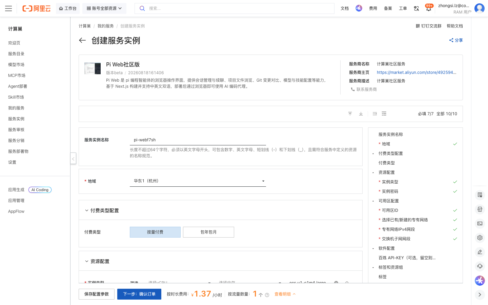
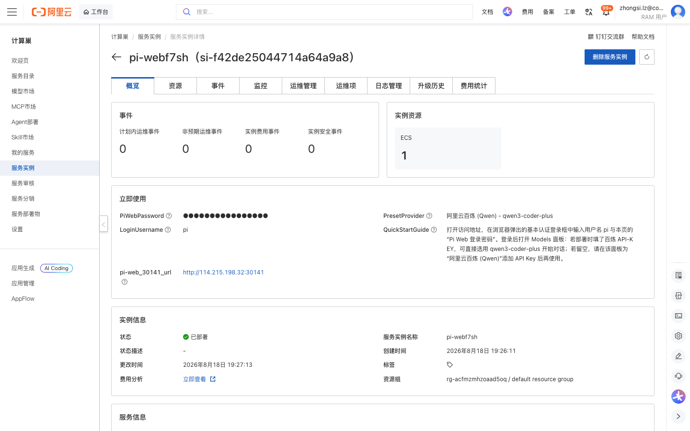
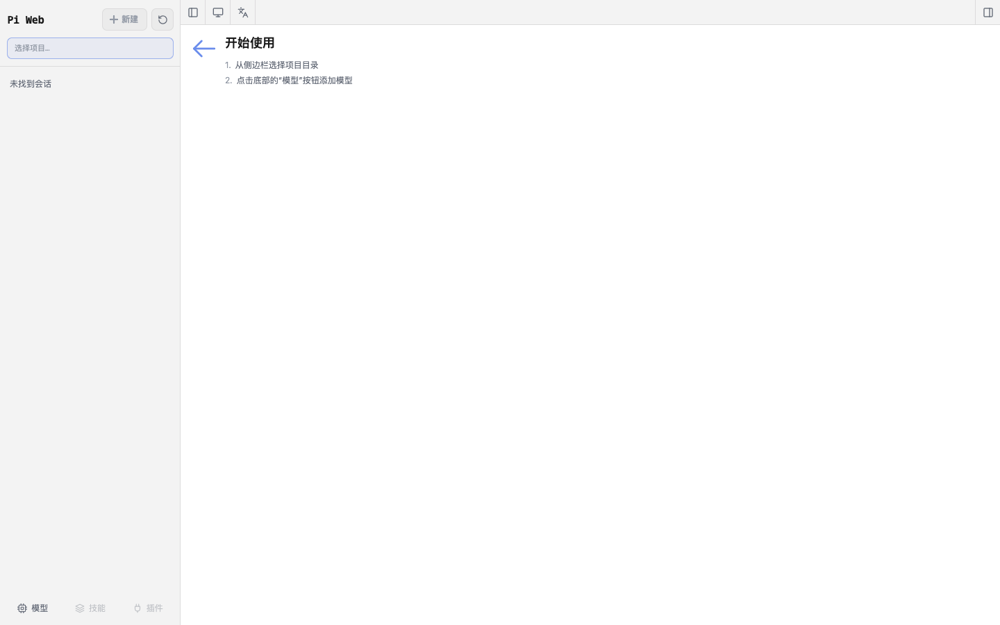

# Pi Web社区版 部署文档

## 概述

Pi Web社区版 是 pi 编程智能体的浏览器操作界面，提供会话管理与续聊、项目文件浏览、Git 变更对比、模型与技能配置等能力，基于 Next.js 构建并支持中英文双语。通过阿里云计算巢服务，您可以在 ECS 上一键部署 Pi Web，部署完成后通过浏览器即可使用 AI 编码代理，无需手动安装 Node.js 与相关依赖。

## 部署流程

### 1. 创建服务实例

访问 Pi Web社区版 服务部署链接，按提示填写部署参数：

[部署链接](https://computenest.console.aliyun.com/service/instance/create/cn-hangzhou?type=user&ServiceId=service-12cd8674c40940ecb17d)

需要关注的参数：

- **实例类型**：建议选择 2 vCPU / 8 GiB 及以上规格（示例：`ecs.u1-c1m4.large`）。
- **实例密码**：用于远程登录 ECS 服务器，长度 8–30 位并满足复杂度要求。
- **可用区 / 专有网络**：可使用默认的新建专有网络，或选择已有网络。
- **百炼 API-KEY（可选）**：填入后部署即可直接使用阿里云百炼 `qwen3-coder-plus` 模型；留空也能正常部署，登录后在 Models 面板再添加模型 Key 即可。

### 2. 确认订单并创建

参数填写完成后可以看到对应询价明细，确认参数后点击 **下一步：确认订单**。确认订单完成后同意服务协议并点击 **立即创建** 进入部署阶段。

### 3. 等待部署完成

等待部署完成后进入服务实例详情页。在 **立即使用** 区可以看到以下信息：

| 输出项 | 说明 |
|---|---|
| `pi-web_30141_url` | Pi Web 访问地址（端口 30141） |
| `LoginUsername` | 登录用户名，固定为 `pi` |
| `PiWebPassword` | Pi Web 登录密码（部署时自动生成的随机密码） |
| `PresetProvider` | 预置模型 Provider（阿里云百炼 Qwen / qwen3-coder-plus） |
| `QuickStartGuide` | 快速使用说明 |

### 4. 访问服务

单击 `pi-web_30141_url` 访问地址，浏览器会弹出基本认证登录框。输入用户名 `pi` 与实例详情页中的 **Pi Web 登录密码** 登录。

登录后进入 Pi Web 界面：从左侧边栏选择项目目录，点击底部的 **模型** 按钮配置模型（若部署时未填写百炼 API-KEY，请在此为「阿里云百炼 (Qwen)」添加 API Key），随后即可新建会话，开始与 AI 编码代理对话。

## 已知行为说明

- **登录鉴权**：Pi Web 采用 HTTP Basic 认证，用户名固定为 `pi`，密码为部署时自动生成的随机密码。请妥善保管密码，勿在公开渠道泄露。
- **模型配置**：若部署时未填写百炼 API-KEY，首次登录后需在 Models 面板添加模型 Key，模型选择器方可使用。
- **数据持久化**：会话记录与模型/凭证配置保存在服务器 `~/.pi/agent` 目录下（`auth.json` / `models.json` / `sessions/*.jsonl`）。
- **使用须知**：本服务基于第三方开源项目 [pi-web](https://github.com/agegr/pi-web)（MIT 许可证）构建，阿里云计算巢仅提供云资源与部署入口。Pi Web 可在您的授权下执行 Shell 命令，请仅在受信任的网络环境中使用，并注意合理管理云资源费用。

## 官方文档

更多信息请访问项目仓库：[pi-web on GitHub](https://github.com/agegr/pi-web)
